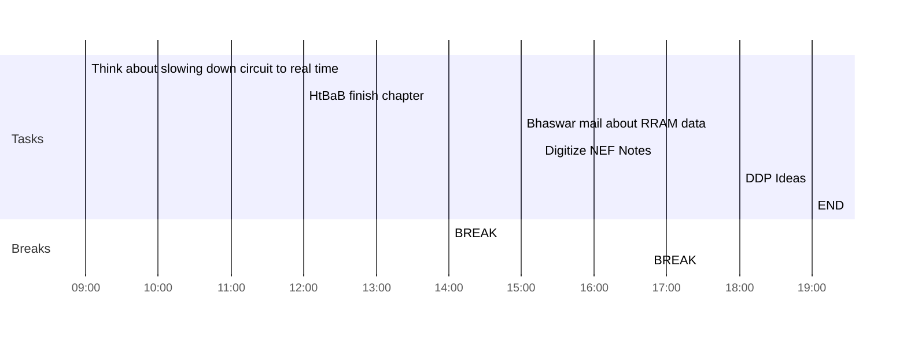

## Day Planner

- [x] 09:00 Think about slowing down circuit to real time
- [x] 12:00 HtBaB finish chapter
- [x] 14:00 BREAK
- [x] 15:00 Bhaswar mail about RRAM data
- [x] 15:15 Digitize NEF Notes
- [x] 16:45 BREAK
- [x] 18:00 DDP Ideas
- [x] 19:00 END