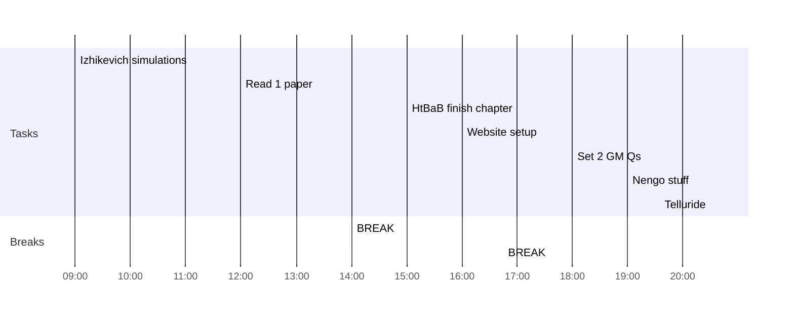

## Day Planner

- [x] 09:00 Izhikevich simulations
- [x] 12:00 Read 1 paper
- [x] 14:00 BREAK
- [x] 15:00 HtBaB finish chapter
- [x] 16:00 Website setup
- [x] 16:45 BREAK
- [ ] 18:00 Set 2 GM Qs
- [ ] 19:00 Nengo stuff
- [ ] 20:30 Telluride