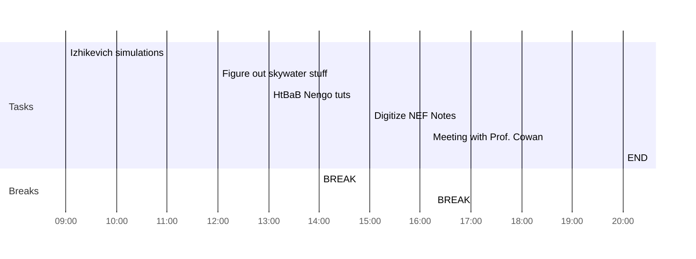

## Day Planner

- [x] 09:00 Izhikevich simulations
- [x] 12:00 Figure out skywater stuff
- [x] 13:00 HtBaB Nengo tuts
- [x] 14:00 BREAK
- [x] 15:00 Digitize NEF Notes
- [x] 16:15 BREAK
- [x] 18:30 Meeting with Prof. Cowan
- [x] 20:00 END