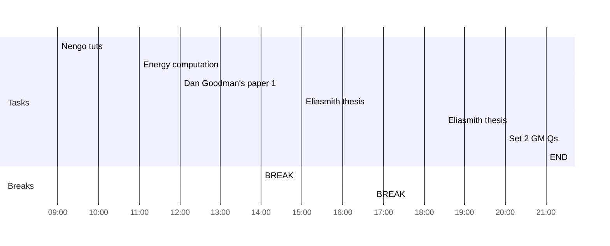

## Day Planner

- [x] 09:00 Nengo tuts
- [ ] 11:00 Energy computation
- [x] 12:00 Dan Goodman's paper 1
- [x] 14:00 BREAK
- [x] 15:00 Eliasmith thesis
- [x] 16:45 BREAK
- [x] 18:30 Eliasmith thesis
- [x] 20:00 Set 2 GM Qs
- [x] 21:00 END