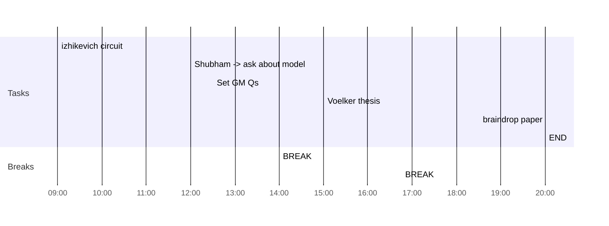

## Day Planner

- [x] 09:00 izhikevich circuit
- [x] 12:00 Shubham -> ask about model
- [x] 12:30 Set GM Qs
- [x] 14:00 BREAK
- [x] 15:00 Voelker thesis
- [x] 16:45 BREAK
- [x] 18:30 braindrop paper
- [x] 20:00 END