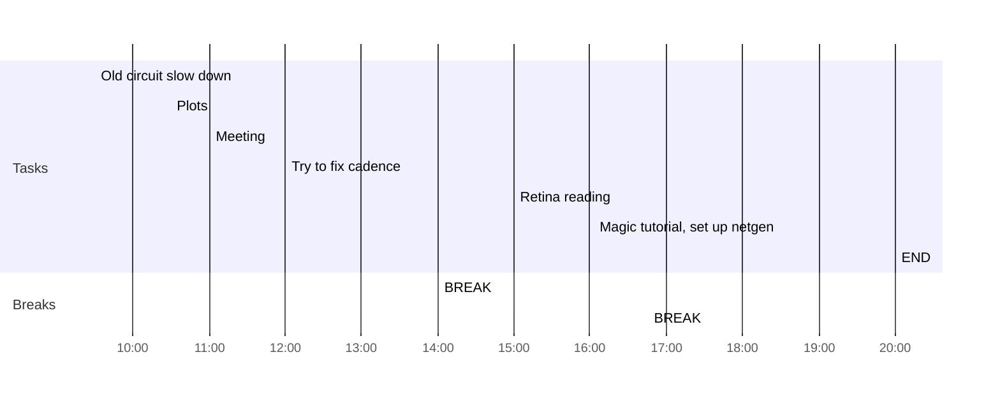

## Day Planner

- [ ] 09:30 Old circuit slow down
- [x] 10:30 Plots
- [x] 11:00 Meeting
- [x] 12:00 Try to fix cadence
- [x] 14:00 BREAK
- [ ] 15:00 Retina reading
- [x] 16:45 BREAK
- [x] 18:30 Magic tutorial, set up netgen
- [x] 20:00 END