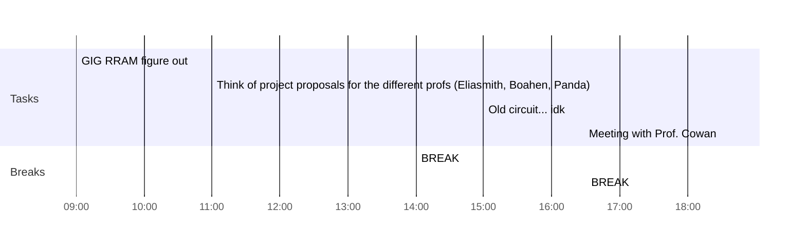

## Day Planner

- [x] 09:00 GIG RRAM figure out
- [x] 11:00 Think of project proposals for the different profs (Eliasmith, Boahen, Panda)
- [x] 14:00 BREAK
- [x] 15:00 Old circuit... idk
- [x] 16:30 BREAK
- [x] 18:30 Meeting with Prof. Cowan

- $C_V\frac{dV}{dt}=I_{M3}-I_{M7}+I_{in}$
- $C_U\frac{dU}{dt}=I_{M9}-I_{M12}$
- $I_{M7}=I_o(W/L)_7e^{\frac{U}{nV_T}}$
- $\frac{dV}{dt} = \frac{I_o}{C_V} [(W/L)_3[1 + \frac{V}{nV_T} + \frac{V^2}{2(nV_T)^2} + \frac{V^3}{6(nV_T)^3} + ...] − k_{bias}(W/L)_4[ 1 + \frac{U}{nV_T} + \frac{U^2}{2(nV_T)^2} + \frac{U^3}{6(nV_T)^3}+ ...]+ \frac{I_{ex}}{C_v}$