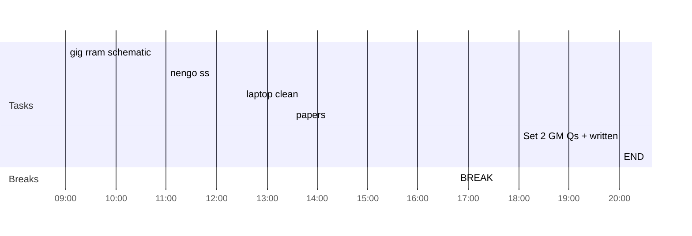

## Day Planner

```mermaid
gantt
    dateFormat  HH-mm
    axisFormat %H:%M
    %% Current Time: 12:20:50 PM
    section Tasks
    gig rram schematic     :09-00, 120mm
    nengo ss     :11-00, 90mm
    laptop clean     :12-30, 60mm
    papers     :13-30, 195mm
    Set 2 GM Qs + written     :18-00, 120mm
    END     :20-00, 0mm
    section Breaks
    BREAK     :16-45, 75mm
```

- [ ] 09:00 gig rram schematic
- [ ] 11:00 nengo ss
- [ ] 12:30 laptop clean
- [ ] 13:30 papers
- [ ] 16:45 BREAK
- [ ] 18:00 Set 2 GM Qs + written
- [ ] 20:00 END