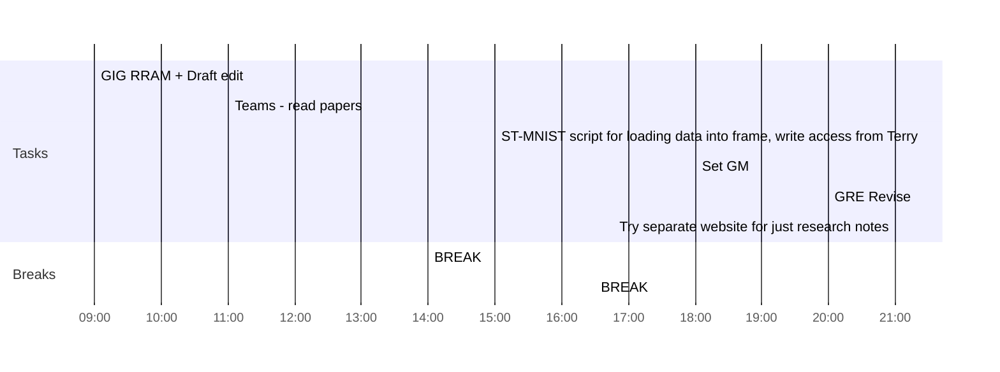

## Day Planner

- [x] 09:00 GIG RRAM + Draft edit
- [x] 11:00 Teams - read papers
- [x] 14:00 BREAK
- [x] 15:00 ST-MNIST script for loading data into frame, write access from Terry
- [x] 16:30 BREAK
- [x] 18:00 Set GM
- [x] 20:00 GRE Revise
- [ ] 21:00 Try separate website for just research notes

Network figure update with neuron clusters, discussion section, 