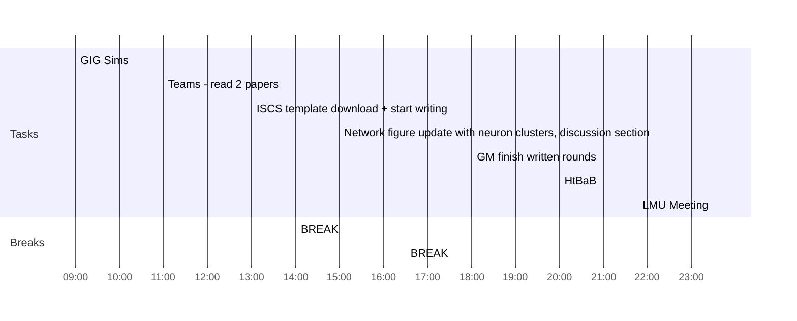

## Day Planner

- [x] 09:00 GIG Sims
- [x] 11:00 Teams - read 2 papers
- [x] 13:00 ISCS template download + start writing
- [x] 14:00 BREAK
- [x] 15:00 Network figure update with neuron clusters, discussion section
- [x] 16:30 BREAK
- [ ] 18:00 GM finish written rounds
- [x] 20:00 HtBaB
- [x] 23:30 LMU Meeting

- [x] Follow up about TA for EE6347
- [x] Rockwood Memorial Lectures
