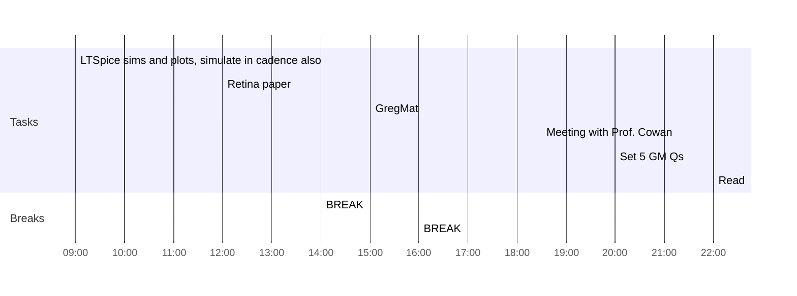

## Day Planner

- [x] 09:00 LTSpice sims and plots, simulate in cadence also
- [ ] 12:00 Retina paper
- [x] 14:00 BREAK
- [x] 15:00 GregMat
- [x] 16:00 BREAK
- [x] 18:30 Meeting with Prof. Cowan
- [ ] 20:00 Set 5 GM Qs
- [ ] 22:00 Read