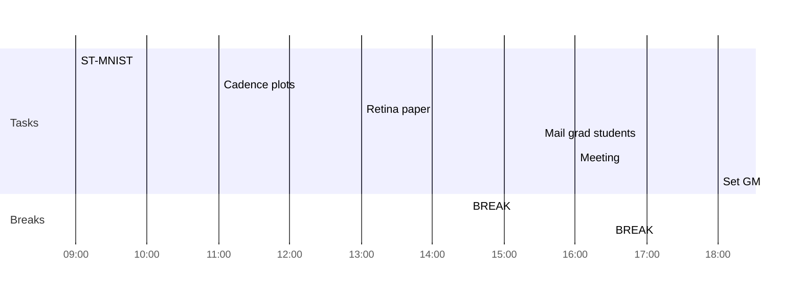

## Day Planner

```mermaid
gantt
    dateFormat  HH-mm
    axisFormat %H:%M
    %% Current Time: 11:59:59 PM
    section Tasks
    ST-MNIST     :09-00, 120mm
    Cadence plots     :11-00, 120mm
    Retina paper     :13-00, 90mm
    Mail grad students     :15-30, 30mm
    Meeting     :16-00, 30mm
    Set GM     :18-00, 0mm
    section Breaks
    BREAK     :14-30, 60mm
    BREAK     :16-30, 90mm
```

- [x] 09:00 ST-MNIST
- [x] 11:00 Cadence plots
- [x] 13:00 Retina paper
- [x] 14:30 BREAK
- [ ] 15:30 Mail grad students
- [x] 16:00 Meeting
- [x] 16:30 BREAK
- [x] 18:00 Set GM